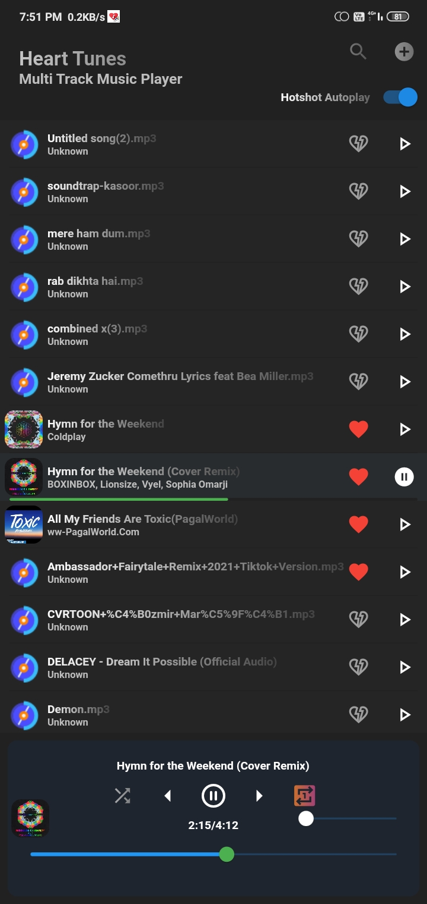

<div align="center">
    
    <h3>Meet Heart Tunes</h3>
</div>


[](https://www.youtube.com/watch?v=2yqgtlKmRGQ)

**Click the above image to see the desktop version in action.**

A simplicity focussed Multi-Track Music Player written in Flutter with Hotshot! Instant Autoplay on Startup.

Heart Tunes currently supports the following features:

- [x] Play Multiple Tracks Simultaneously
- [x] Adjust Volumes for Different Tracks Independently
- [x] Hotshot! Autoplay on Startup
- [x] Basic Player Functionalities:
  - [x] Shuffle
  - [x] Repeat
  - [x] Seek
  - [x] Play/Pause
  - [x] Previous/Next
- [x] Instant Startup (Of Course! It's Flutter at its back)
- [x] Dark UI

Planned Features:
- [ ] Track Autoplay Scheduler
- [ ] Autoplay from last track position
- [ ] Sort
- [ ] Your suggestions

# *Build* from Source / *Using*

## Running in Emulator 
Either built it from the shell
```shell
git clone https://github.com/omegaui/heart_tunes
cd heart_tunes
flutter run
```
or use an IDE like IntelliJ.

OR

## Build APK
with
```shell
flutter build apk
```

### say("Thanks!") goes to these amazing open source projects' maintainers and [icons8.com](https://icons8.com)

Even the creative app icon is derived from icons8.com

```yaml
id3: ^1.0.2
file_picker: ^4.6.1
audioplayers: ^1.0.1
window_manager: ^0.2.5
url_launcher: ^6.1.4
percent_indicator: ^4.2.2
flutter_background: ^1.1.0
animated_text_kit: ^4.2.2
flutter_native_splash: ^2.2.3+1
flutter_launcher_icons: ^0.9.3
```

